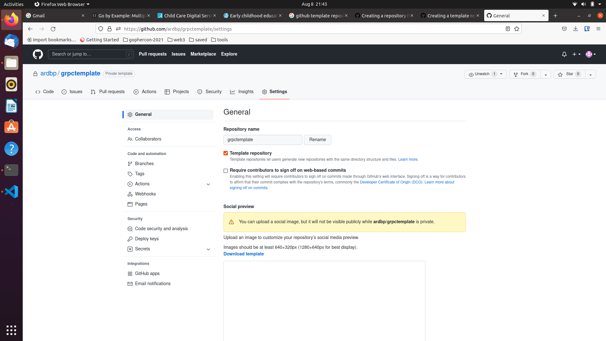
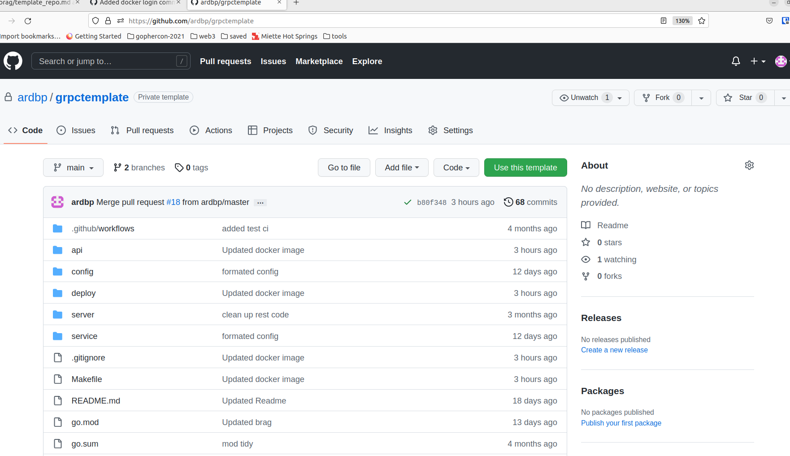
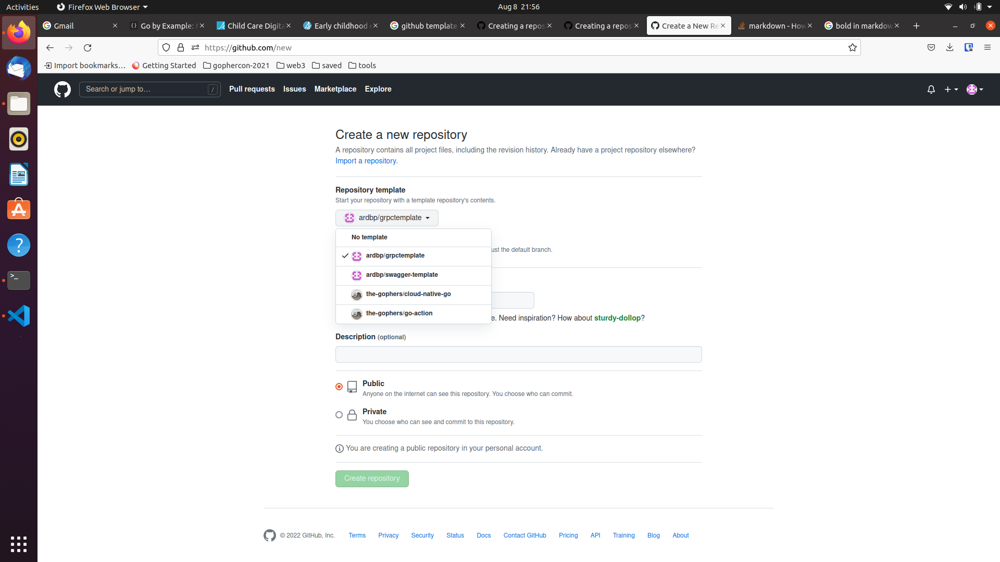

# **Github Template repository**
Github template repository will allow to create new repository with the same directory structure and files as it is available in github template repository.

This could be very useful for createing service-template and few other things.

## **How to make an existing repository to Template repo.**

* On GitHub.com, navigate to the main page of the repository.
  
* Under your repository name, click Settings. 
  
* Select template repository

## **Creating repository from Template repository**

* Open template repo from github, For example if template repo is github.com/ardbp/grpctemplate
** Method 1. 

* Create new repo from selecting New github repository interface  

* Select template from repository template options

* Optionally select include all branches if you would like to have all branches availeble in template repository.
  
* Specify repository name and description 
  
* Select Public/Private option
  
* Create repository
